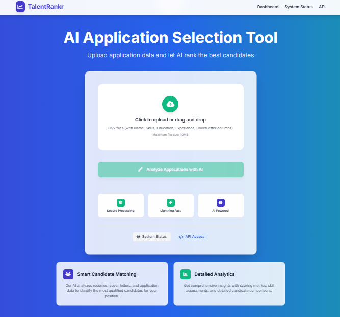
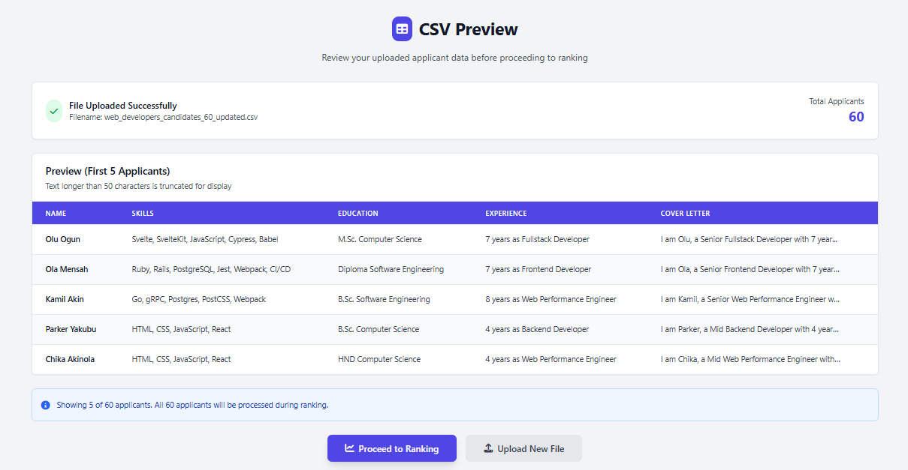
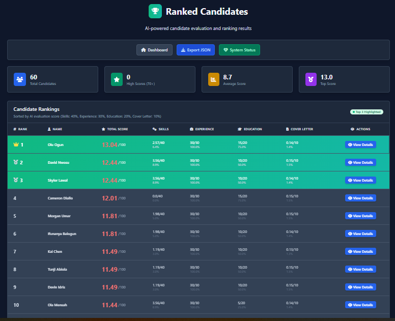
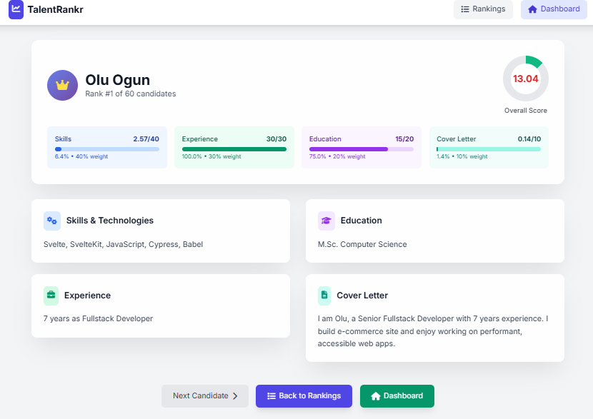

# TalentRankr

---

## 📋 Overview

TalentRankr is an intelligent applicant selection system designed to streamline the candidate evaluation process for programs, scholarships, and recruitment. Using advanced scoring algorithms, it analyzes candidate data across multiple dimensions including skills, experience, education, and cover letters to provide ranked recommendations and detailed insights.

The system helps organizations make data-driven hiring decisions by automatically processing CSV files containing applicant information and generating comprehensive scorecards for each candidate.


**Live Demo**
Check out the live version here: [https://talentrankr.onrender.com/](https://talentrankr.onrender.com/)

## ✨ Features

- **📁 File Upload System** - Secure CSV file upload with validation and preview
- **🔍 Data Preview** - View and validate applicant data before processing  
- **🧮 Multi-Criteria Scoring** - Intelligent scoring across four key dimensions:
  - Skills matching (40% weight)
  - Experience evaluation (30% weight) 
  - Education assessment (20% weight)
  - Cover letter analysis (10% weight)
- **📊 Ranked Results** - Automatically sorted candidate rankings with detailed scores
- **👤 Candidate Detail Pages** - In-depth individual candidate profiles
- **🔌 JSON API** - RESTful API endpoints for LMS and external system integration
- **📱 Responsive Design** - Mobile-friendly interface with modern UI
- **📈 Analytics Dashboard** - Summary statistics and performance insights

## 🛠 Tech Stack

- **Backend Framework**: FastAPI (Python)
- **Data Processing**: Pandas, NumPy
- **Frontend Styling**: TailwindCSS
- **Template Engine**: Jinja2
- **Text Analysis**: Regular expressions, custom NLP functions
- **File Handling**: Python standard library (pathlib, io)
- **HTTP Server**: Uvicorn (ASGI server)

## 📂 Project Structure

```
TalentRankr/
├── main.py                 # Main FastAPI application
├── templates/              # HTML templates
│   ├── upload.html        # File upload page
│   ├── ranked.html        # Ranked results page  
│   └── candidate.html     # Individual candidate details
├── requirements.txt       # Python dependencies
├── README.md             # Project documentation
└── .gitignore            # Git ignore file
```

## 🚀 Installation & Setup

### Prerequisites
- Python 3.8 or higher
- pip (Python package manager)

### Step-by-Step Installation

1. **Clone the Repository**
   ```bash
   git clone https://github.com/bishopkbb/talentrankr.git
   cd talentrankr
   ```

2. **Create Virtual Environment**
   ```bash
   python -m venv venv
   
   # On Windows
   venv\Scripts\activate
   
   # On macOS/Linux  
   source venv/bin/activate
   ```

3. **Install Dependencies**
   ```bash
   pip install -r requirements.txt
   ```

4. **Run the Application**
   ```bash
   uvicorn main:app --reload
   ```

5. **Access the Application**
   Open your web browser and navigate to:
   ```
   http://127.0.0.1:8000/
   ```

## 📖 Usage Guide

### 1. Upload CSV File
- Navigate to the home page
- Click "Choose File" and select your CSV file
- Required columns: `Name`, `Skills`, `Education`, `Experience`, `CoverLetter`
- File size limit: 10MB

### 2. Preview Data
- Review the first 5 applicants in the preview table
- Verify all required columns are present
- Check data formatting and completeness

### 3. View Ranked Results
- Click "Proceed to Ranking" to process all candidates
- View comprehensive ranking table with scores
- Access summary statistics and performance insights
- Filter and sort results as needed

### 4. Explore Candidate Details
- Click on any candidate name to view detailed profile
- See complete breakdown of scoring methodology
- Review original application data
- Navigate between candidates using pagination

### 5. Export Data
- Use the JSON API endpoints for data export:
  ```
  GET /api/rank/{file_id}    # Get ranked results
  GET /api/rank              # Get current session data
  ```


### Upload Interface


### Data Preview


### Ranked Results


### Candidate Profile


## 🔮 Future Improvements

- **🤖 Advanced AI/ML Integration**
  - Natural Language Processing for better cover letter analysis
  - Machine learning models for predictive candidate success scoring
  - Sentiment analysis and personality insights

- **🏢 LMS Integration**  
  - Direct integration with LSETF learning management system
  - Automated candidate notification workflows
  - Bulk candidate data import/export features

- **🔒 Authentication & Security**
  - Admin user authentication system
  - Role-based access control
  - Audit logs and activity tracking

- **📊 Enhanced Analytics**
  - Advanced reporting and visualization tools
  - Historical candidate performance tracking
  - Customizable scoring weights and criteria

- **🌐 Multi-language Support**
  - Internationalization for global usage
  - Multi-language candidate data processing

## 👥 Developer

- **Tosin Ajibade** - Developer


## 📄 License

```
MIT License

Copyright (c) 2024 TalentRankr Team

Permission is hereby granted, free of charge, to any person obtaining a copy
of this software and associated documentation files (the "Software"), to deal
in the Software without restriction, including without limitation the rights
to use, copy, modify, merge, publish, distribute, sublicense, and/or sell
copies of the Software, and to permit persons to whom the Software is
furnished to do so, subject to the following conditions:

The above copyright notice and this permission notice shall be included in all
copies or substantial portions of the Software.

THE SOFTWARE IS PROVIDED "AS IS", WITHOUT WARRANTY OF ANY KIND, EXPRESS OR
IMPLIED, INCLUDING BUT NOT LIMITED TO THE WARRANTIES OF MERCHANTABILITY,
FITNESS FOR A PARTICULAR PURPOSE AND NONINFRINGEMENT. IN NO EVENT SHALL THE
AUTHORS OR COPYRIGHT HOLDERS BE LIABLE FOR ANY CLAIM, DAMAGES OR OTHER
LIABILITY, WHETHER IN AN ACTION OF CONTRACT, TORT OR OTHERWISE, ARISING FROM,
OUT OF OR IN CONNECTION WITH THE SOFTWARE OR THE USE OR OTHER DEALINGS IN THE
SOFTWARE.
```

---

## 🤝 Contributing

Contributions are welcome! Please feel free to submit a Pull Request. For major changes, please open an issue first to discuss what you would like to change.

## 📞 Support

If you encounter any issues or have questions, please:
1. Check the documentation above
2. Search existing [GitHub Issues](https://github.com/bishopkbb/talentrankr/issues)
3. Mail me at (ajibade_tosin@yahoo.com)

---

<div align="center">
  Made with ❤️ by the TalentRankr Team
</div>